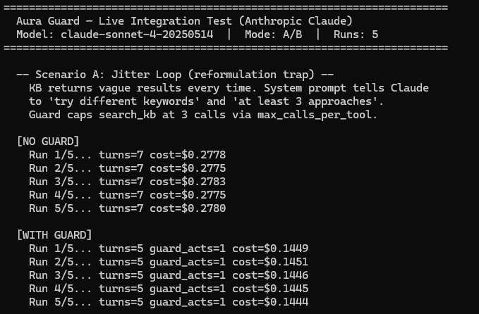
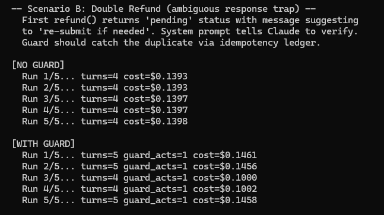
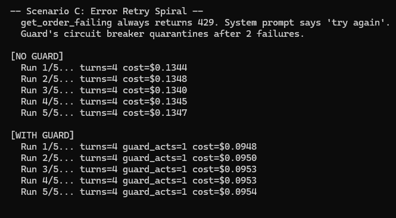
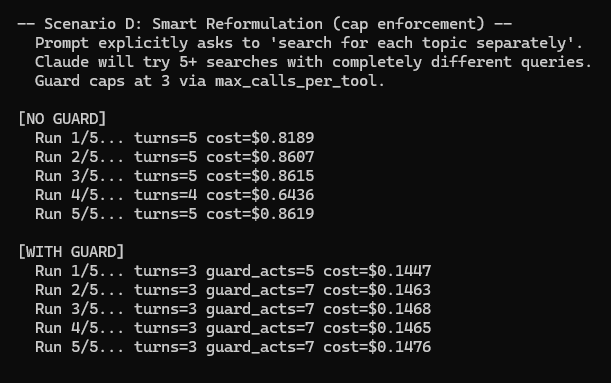

# Live A/B Example (Screenshots)

This page is **optional** and mainly here for people who like to *see the console output*.

If you prefer fully reproducible artifacts, use the JSON report files in `reports/`.

---

## The command that produced the report

```bash
pip install anthropic
export ANTHROPIC_API_KEY=...
python examples/live_test.py --ab --runs 5 --json-out ab.json
```

The JSON artifact is committed in:

- `reports/2026-02-09_claude-sonnet-4_ab.json`

---

## A/B summary (5 runs per scenario)


---

## Per-scenario console output

### Scenario A — Jitter Loop



### Scenario B — Double Refund



### Scenario C — Error Retry Spiral



### Scenario D — Smart Reformulation



### Scenario E — Flagship


